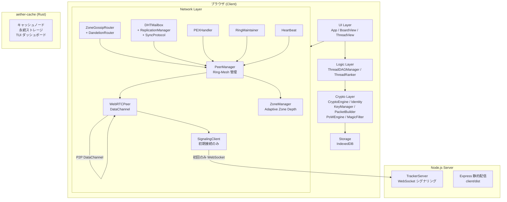

# AETHER Web-Lite — 現状アーキテクチャ監査

> 基準点: Git ロールバック後の現在のコードベース (2026-04-05)

---

## 1. システム全体構成



---

## 2. レイヤー別ファイルマップ

### 2.1 Network Layer（13ファイル — 最大・最重要）

| ファイル | サイズ | 責務 |
|:---------|:------:|:-----|
| [PeerManager.ts](file:///Users/fujinami/github/aether-web-lite/client/src/network/PeerManager.ts) | 8.7KB | 全ピア管理。Ring位置ベースの接続選択、Zone-aware優先度、evict戦略 |
| [WebRTCPeer.ts](file:///Users/fujinami/github/aether-web-lite/client/src/network/WebRTCPeer.ts) | 5.9KB | 単一WebRTC接続の抽象化。SDP/ICE, DataChannel |
| [ZoneManager.ts](file:///Users/fujinami/github/aether-web-lite/client/src/network/ZoneManager.ts) | 5.4KB | Adaptive Zone Depth。CIDR方式のサブネッティング、K=16匿名購読 |
| [ZoneGossipRouter.ts](file:///Users/fujinami/github/aether-web-lite/client/src/network/gossip/ZoneGossipRouter.ts) | 5.9KB | ゾーン内BFS Flood。ゾーンフィルタリング、seen管理 |
| [DandelionRouter.ts](file:///Users/fujinami/github/aether-web-lite/client/src/network/gossip/DandelionRouter.ts) | 4.7KB | Dandelion++ Stem/Fluff。越境インジェクション |
| [DHTMailbox.ts](file:///Users/fujinami/github/aether-web-lite/client/src/network/mailbox/DHTMailbox.ts) | 8.0KB | DHT PUT/GET。K最近接ノードへの分散保存 |
| [ReplicationManager.ts](file:///Users/fujinami/github/aether-web-lite/client/src/network/mailbox/ReplicationManager.ts) | 3.3KB | Mailbox再レプリケーション |
| [SyncProtocol.ts](file:///Users/fujinami/github/aether-web-lite/client/src/network/mailbox/SyncProtocol.ts) | 2.9KB | スレッド過去ログの同期要求 |
| [SignalingClient.ts](file:///Users/fujinami/github/aether-web-lite/client/src/network/SignalingClient.ts) | 3.5KB | WebSocket→Tracker。初期ピア発見のみ |
| [RingPosition.ts](file:///Users/fujinami/github/aether-web-lite/client/src/network/RingPosition.ts) | 1.7KB | 円環位置の生成・永続化・距離計算 |
| [RingMaintainer.ts](file:///Users/fujinami/github/aether-web-lite/client/src/network/RingMaintainer.ts) | 2.9KB | リング構造の自動修復 |
| [PEXHandler.ts](file:///Users/fujinami/github/aether-web-lite/client/src/network/PEXHandler.ts) | 2.8KB | Peer Exchange。ロングレンジ候補探索 |
| [Heartbeat.ts](file:///Users/fujinami/github/aether-web-lite/client/src/network/Heartbeat.ts) | 2.5KB | Ping/Pong 死活監視 |

### 2.2 Crypto Layer（7ファイル）

| ファイル | サイズ | 責務 |
|:---------|:------:|:-----|
| [PacketBuilder.ts](file:///Users/fujinami/github/aether-web-lite/client/src/crypto/PacketBuilder.ts) | 4.6KB | ゴシップパケットの組み立て（暗号化+PoW+署名） |
| [Identity.ts](file:///Users/fujinami/github/aether-web-lite/client/src/crypto/Identity.ts) | 2.9KB | セッション鍵ペア＋トリップ（永続ID）管理 |
| [KeyManager.ts](file:///Users/fujinami/github/aether-web-lite/client/src/crypto/KeyManager.ts) | 2.2KB | boardKey→threadKey→topicHash の導出チェーン |
| [CryptoEngine.ts](file:///Users/fujinami/github/aether-web-lite/client/src/crypto/CryptoEngine.ts) | 2.1KB | XSalsa20-Poly1305 暗号化/復号 |
| [DifficultyEstimator.ts](file:///Users/fujinami/github/aether-web-lite/client/src/crypto/DifficultyEstimator.ts) | 1.5KB | PoW難易度の動的調整 |
| [MagicFilter.ts](file:///Users/fujinami/github/aether-web-lite/client/src/crypto/MagicFilter.ts) | 1.5KB | 復号可否の高速判定（マジックバイト） |
| [PoWEngine.ts](file:///Users/fujinami/github/aether-web-lite/client/src/crypto/PoWEngine.ts) | 1.1KB | Proof-of-Work メインスレッド版 |

### 2.3 Logic Layer（2ファイル）

| ファイル | サイズ | 責務 |
|:---------|:------:|:-----|
| [ThreadDAGManager.ts](file:///Users/fujinami/github/aether-web-lite/client/src/logic/ThreadDAGManager.ts) | 5.0KB | スレッド内レスのDAG（有向非巡回グラフ）管理 |
| [ThreadRanker.ts](file:///Users/fujinami/github/aether-web-lite/client/src/logic/ThreadRanker.ts) | 1.6KB | スレッドのヒートスコア算出 |

### 2.4 UI Layer（4ファイル）

| ファイル | サイズ | 責務 |
|:---------|:------:|:-----|
| [App.ts](file:///Users/fujinami/github/aether-web-lite/client/src/ui/App.ts) | 4.3KB | ルートコンポーネント。hash routing。header+main構成 |
| [BoardView.ts](file:///Users/fujinami/github/aether-web-lite/client/src/ui/BoardView.ts) | 10.8KB | 板（スレッド一覧）。新スレ作成、リアルタイム更新 |
| [ThreadView.ts](file:///Users/fujinami/github/aether-web-lite/client/src/ui/ThreadView.ts) | 11.7KB | スレッド本文。DAG表示、レス投稿、過去ログ同期 |
| [Component.ts](file:///Users/fujinami/github/aether-web-lite/client/src/ui/Component.ts) | 0.8KB | 基底コンポーネント（mount/unmount/render） |

### 2.5 Infrastructure

| ファイル | 責務 |
|:---------|:-----|
| [main.ts](file:///Users/fujinami/github/aether-web-lite/client/src/main.ts) | ブートストラップ。全モジュールの初期化と配線 |
| [types.ts](file:///Users/fujinami/github/aether-web-lite/client/src/types.ts) | 型定義。P2PMessage, IPeerManager, IMailbox 等 |
| [constants.ts](file:///Users/fujinami/github/aether-web-lite/client/src/constants.ts) | RING_MESH / RING_MESH_ZONE / TRACKER パラメータ |
| [IndexedDBStore.ts](file:///Users/fujinami/github/aether-web-lite/client/src/storage/IndexedDBStore.ts) | IndexedDB ラッパー |
| [pow.worker.ts](file:///Users/fujinami/github/aether-web-lite/client/src/worker/pow.worker.ts) | PoW Web Worker |
| [WorkerBridge.ts](file:///Users/fujinami/github/aether-web-lite/client/src/worker/WorkerBridge.ts) | Worker通信ブリッジ |

### 2.6 Server（Node.js — 最小構成）

| ファイル | 責務 |
|:---------|:-----|
| [index.ts](file:///Users/fujinami/github/aether-web-lite/server/src/index.ts) | Express + TrackerServer 起動 |
| [TrackerServer.ts](file:///Users/fujinami/github/aether-web-lite/server/src/TrackerServer.ts) | WebSocket シグナリング。ピアリスト配布 |
| [SessionManager.ts](file:///Users/fujinami/github/aether-web-lite/server/src/SessionManager.ts) | セッション管理 |

### 2.7 aether-cache（Rust）

永続キャッシュノード。ブラウザが閉じていてもメッセージを保持する中継ノード。

---

## 3. データフロー概要

### 3.1 書き込み（投稿）フロー

```
ユーザー入力
  → PacketBuilder.buildPost()
    → CryptoEngine.encrypt(threadKey, plaintext)
    → PoWEngine.compute(difficulty)
    → Identity.sign()
  → ZoneGossipRouter を経由して配信
    → DandelionRouter.stem() で匿名化
    → ゾーンメイトへ BFS Flood
  → DHTMailbox.publish() で永続保存
  → IndexedDB にローカルキャッシュ
```

### 3.2 読み取り（同期）フロー

```
スレッドを開く
  → IndexedDB から既知のレスを復元
  → SyncProtocol.syncThread() でピアに過去ログ要求
  → DHTMailbox.fetch() で Mailbox からデータ取得
  → CryptoEngine.decrypt(threadKey) で復号
  → ThreadDAGManager.addPost() で DAG に挿入
  → UI 描画
  → ZoneGossipRouter.onMessage() でリアルタイム受信待ち
```

### 3.3 鍵の導出チェーン

```
boardKey (32byte, 共有秘密 or ハッシュ生成)
  └─ threadKey = HKDF(boardKey, threadId)
       ├─ topicHash = SHA256(threadKey)  → DHTのアドレス
       ├─ zoneId = topicHash[0..depth]   → ゾーン振り分け
       └─ encrypt/decrypt の対称鍵
```

---

## 4. 設計の核心思想

### 4.1 Ring-Mesh + Adaptive Zone（二層構造）

- **Layer 1 (Ring-Mesh)**: 円環上にノードを配置。左右2+2=4本のローカルリンクでリング構造を保証。PEXでロングレンジリンクを追加（最大12本）。構造的連結性の保証。
- **Layer 2 (Adaptive Zone)**: スレッドのハッシュ先頭ビットでゾーンIDを決定（CIDR方式）。ノード数に応じてdepthが自動調整。16ゾーン購読でK-匿名性を確保。

### 4.2 匿名性の実現手段

1. **Broadcast Veil** (depth≤4): 全ゾーン購読。購読情報が漏れない（最強）
2. **K=16 Anonymous** (depth>4): 16ゾーン購読。本命特定確率 6.25%
3. **Dandelion++**: Stem フェーズで送信者を隠蔽。Fluff 地点から Zone 内に注入
4. **セッション固定購読**: 交差攻撃防止。購読セットはセッション中不変

### 4.3 サーバーの役割（最小限）

- TrackerServer は **初期接続の仲介のみ**（15秒後に切断）
- 以降は完全P2P（WebRTC DataChannel）
- aether-cache は補助的な永続ノード（ブラウザ離脱時のデータ保持）

---

## 5. 現状の UI/UX

- **hash routing**: `#board=vip`, `#board=xxx&thread=yyy`
- **単一ビュー切り替え**: App が header + main を保持。BoardView か ThreadView のどちらかを main に mount
- **デフォルト板**: `vip`（ハードコード。seed `AETHER_LITE_VIP_DEFAULT_SEED` からboardKeyを生成）
- **CSS**: [index.css](file:///Users/fujinami/github/aether-web-lite/client/src/index.css) + [style.css](file:///Users/fujinami/github/aether-web-lite/client/src/style.css)
- **デザイン**: PoC レベル。レトロモダン風のダークテーマ

---

## 6. 現状のビルド・実行環境

```bash
# Client (Vite + TypeScript)
cd client && npm run build   # → client/dist/

# Server (Express + WebSocket)
cd server && npm run dev     # → localhost:3000 (静的配信 + シグナリング)

# Cache Node (Rust)
cd aether-cache && cargo run  # → 永続キャッシュノード

# ngrok (外部公開用)
ngrok http 3000
```

> [!IMPORTANT]
> Vite 開発サーバー（`npm run dev` in client）ではなく、ビルド済み静的ファイルを Express で配信する構成。
> ngrok 1つで フロントエンド + シグナリング WebSocket を同時公開。

---

## 7. 補足：確定仕様書

- [step1_ring_mesh_zone.md](file:///Users/fujinami/github/aether-web-lite/docs/spec/step1_ring_mesh_zone.md) — Ring-Mesh + Adaptive Zone の確定仕様（シミュレーション実証済み）
- [aether_web_lite_design.md](file:///Users/fujinami/github/aether-web-lite/docs/aether_web_lite_design.md) — 全体設計ドキュメント (53KB)
- [implementation_guide.md](file:///Users/fujinami/github/aether-web-lite/docs/implementation_guide.md) — 実装ガイド (34KB)
