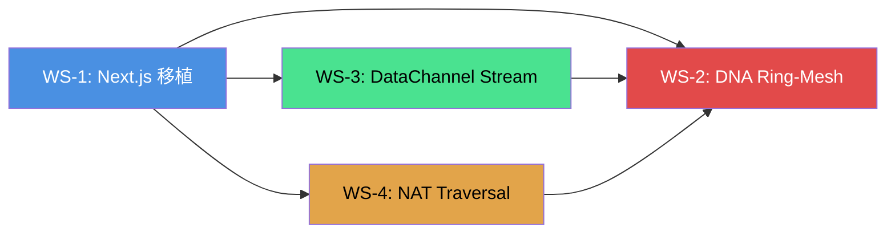

# AETHER Web-Lite v2 — マスタータスクリスト

> 作成日: 2026-04-05
> ステータス: 🟡 計画段階

---

## 全体方針

| 制約 | 決定 |
|:-----|:-----|
| TURN サーバー | **絶対に不使用** |
| NAT 超え戦略 | v6 で NAT を迂回。v4 は STUN のみ |
| フレームワーク | Next.js に全面移植 |
| DataChannel | チャンク分割ストリーム実装 |
| 設計思想 | α/β/αβ どの比率でも安定動作 |

---

## ワークストリーム一覧



| ID | ワークストリーム | 優先度 | 依存 | 理由 |
|:---|:----------------|:------:|:----:|:-----|
| **WS-1** | Next.js 移植 | 🔴 最優先 | なし | 土台。全ての変更の前提 |
| **WS-2** | DNA Ring-Mesh | 🔴 高 | WS-1, WS-3, WS-4 | 本丸。v4/v6 二重リング |
| **WS-3** | DataChannel Stream | 🟡 中 | WS-1 | 同期通信の安定化 |
| **WS-3.5** | Binary Wire Protocol | 🟡 中 | WS-1 | JSON 4倍膨張の根絶（MsgPack化） |
| **WS-4** | NAT Traversal 戦略 | 🟡 中 | WS-1 | モバイル v6 対応 |

> [!IMPORTANT]
> **実行順序: WS-1 → (WS-3 + WS-3.5 同時 + WS-4 並行) → WS-2**
> 
> WS-3.5 は WS-3 と同時に実装する（チャンク分割とバイナリ化は同じ送受信パスを改修するため）。

---

## WS-1: Next.js 移植

### 概要
Vite (クライアント) + Express (サーバー) + 手動ビルドフローを、
Next.js のモノレポ構成に統合する。

### サブタスク

| # | タスク | 詳細 | 規模 |
|:-:|:-------|:-----|:----:|
| 1.1 | Next.js プロジェクト初期化 | `npx create-next-app` で新構造を作成。App Router 採用 | 小 |
| 1.2 | WebSocket シグナリング移植 | TrackerServer → Next.js Route Handler or custom server | 中 |
| 1.3 | P2P ネットワーク層の移植 | `client/src/network/**` → Next.js のクライアントサイドモジュールへ。`"use client"` 境界の設計 | **大** |
| 1.4 | Crypto 層の移植 | libsodium-wrappers のブラウザ側ロード戦略（dynamic import） | 中 |
| 1.5 | Storage 層の移植 | IndexedDB はブラウザ API なので `"use client"` コンポーネントへ | 小 |
| 1.6 | UI の React 化 | App.ts / BoardView.ts / ThreadView.ts → React コンポーネント + Hooks | **大** |
| 1.7 | CSS / デザインシステム構築 | style.css + index.css → CSS Modules or Tailwind | 中 |
| 1.8 | ルーティング整理 | hash routing → Next.js App Router (`/board/[id]`, `/board/[id]/thread/[tid]`) | 中 |
| 1.9 | Web Worker 移植 | pow.worker.ts → Next.js 対応 Worker | 小 |
| 1.10 | ビルド・デプロイ整理 | Vite/Express の config 削除、Next.js の本番設定 | 小 |

### ファイルマッピング（旧 → 新）

```
旧構造                          新構造 (Next.js App Router)
─────────                       ──────────────────────────
client/src/main.ts           → app/providers.tsx (Context初期化)
client/src/ui/App.ts         → app/layout.tsx
client/src/ui/BoardView.ts   → app/board/[boardId]/page.tsx
client/src/ui/ThreadView.ts  → app/board/[boardId]/thread/[threadId]/page.tsx
client/src/ui/Component.ts   → 廃止（React化）

client/src/network/**        → lib/network/** ("use client" boundary)
client/src/crypto/**         → lib/crypto/**
client/src/logic/**          → lib/logic/**
client/src/storage/**        → lib/storage/**
client/src/worker/**         → lib/worker/**

client/src/types.ts          → lib/types.ts
client/src/constants.ts      → lib/constants.ts

server/src/index.ts          → server.ts (Next.js custom server)
server/src/TrackerServer.ts  → lib/server/TrackerServer.ts
server/src/SessionManager.ts → lib/server/SessionManager.ts
```

---

## WS-2: DNA Ring-Mesh

### 概要
IPv4 / IPv6 の二重リング構造を実装。
Bridge ノード（Dual-Stack）が Strand 間のゴシップを中継。

### サブタスク

| # | タスク | 詳細 | 規模 |
|:-:|:-------|:-----|:----:|
| 2.1 | StrandDetector 実装 | ICE 候補から v4/v6/bridge を自動判定 | 中 |
| 2.2 | PeerManager の Strand 対応 | 接続管理を Strand 別に分割。Bridge 用 MAX_DEGREE=20 | **大** |
| 2.3 | RingMaintainer の二重化 | α/β 各 Strand で独立したリング修復 | 中 |
| 2.4 | Base Pair リレー | ZoneGossipRouter に Cross-Strand 転送を追加 | 中 |
| 2.5 | Dandelion++ Strand 制約 | Stem は同一 Strand 内限定 | 小 |
| 2.6 | TrackerServer Strand 対応 | strandType 送受信 + Strand-aware ペア選択 | 中 |
| 2.7 | PEX の Strand 拡張 | ロングレンジ候補に Strand 情報を含める | 中 |
| 2.8 | Strand Migration | モバイルの v4↔v6 切替時の自動移行 | **大** |
| 2.9 | α/β/αβ バランス安定化 | 偏った比率での接続予算調整ロジック | 中 |
| 2.10 | 統合テスト | 混在環境でのゴシップ到達率検証 | 中 |

### 安定性要件（α/β/αβ 各比率）

| シナリオ | 期待動作 |
|:---------|:---------|
| α:β:αβ = 80:10:10 | α-Strand 主力。少数の Bridge が β への橋渡し |
| α:β:αβ = 10:80:10 | β-Strand 主力。同上（逆方向） |
| α:β:αβ = 5:5:90 | 事実上の単一リング（全員が両方に参加） |
| α:β:αβ = 45:45:10 | DNA 理想形。Bridge が希少だが重要 |
| α:β:αβ = 50:50:0 | **2分断**。Bridge 皆無なので完全に別ネットワーク |
| α:β:αβ = 100:0:0 | 単一α-Strand = 現行 Ring-Mesh |

---

## WS-3: DataChannel Stream

### 概要
WebRTC DataChannel のメッセージサイズ制限を克服する。
ブラウザ実装により 16KB or ~64KB でフラグメントエラーが発生する現状を、
アプリケーション層でのチャンク分割ストリームで解決。

### サブタスク

| # | タスク | 詳細 | 規模 |
|:-:|:-------|:-----|:----:|
| 3.1 | チャンクプロトコル設計 | ヘッダ構造（msgId, seqNo, totalChunks, payload）の定義 | 小 |
| 3.2 | ChunkedSender 実装 | 大きなメッセージを自動分割して送信 | 中 |
| 3.3 | ChunkedReceiver 実装 | チャンクの再組み立て。タイムアウト・欠損処理 | 中 |
| 3.4 | WebRTCPeer への統合 | send/onData をチャンク対応に差し替え | 中 |
| 3.5 | バックプレッシャー制御 | DataChannel の bufferedAmount 監視。送信レート制御 | 中 |
| 3.6 | SCTP ストリーム検討 | DataChannel の `ordered: false` + 複数チャネル活用 | 小 |

### チャンクプロトコル案

```
┌──────────────────────────────────────────┐
│  Header (12 bytes)                       │
│  ┌─────────┬────────┬────────┬─────────┐ │
│  │ msgId   │ seqNo  │ total  │ flags   │ │
│  │ (4B)    │ (2B)   │ (2B)   │ (4B)    │ │
│  └─────────┴────────┴────────┴─────────┘ │
│  Payload (max 4KB per chunk)             │
│  ┌──────────────────────────────────────┐ │
│  │ ... chunk data ...                   │ │
│  └──────────────────────────────────────┘ │
└──────────────────────────────────────────┘

1メッセージの最大サイズ: 4KB × 65535チャンク ≈ 256MB (理論上限)
実用上限: 数十KB〜数MB (ゴシップパケット + 同期データ)
```

---

## WS-4: NAT Traversal 戦略

### 概要
TURN 不使用を前提に、モバイル端末の NAT 超えを最大化する。
v6 で NAT を回避し、v4 は STUN ベストエフォートとする。

### サブタスク

| # | タスク | 詳細 | 規模 |
|:-:|:-------|:-----|:----:|
| 4.1 | NAT タイプ検出 | STUN で NAT タイプを判定（Full Cone / Symmetric 等） | 中 |
| 4.2 | v6 優先 ICE 戦略 | ICE 候補の優先度を v6 > v4 に設定 | 小 |
| 4.3 | ICE 候補フィルタリング | 不要な候補を除外してネゴシエーション高速化 | 小 |
| 4.4 | 接続成功率の計測 | v4/v6 別の接続成功率をログ収集 | 小 |
| 4.5 | Symmetric NAT 検出時の戦略 | v4 で Symmetric NAT を検出したら v6 にフォールバック | 中 |
| 4.6 | モバイルネットワーク切替検出 | `navigator.connection` + ICE restart | 中 |
| 4.7 | STUN サーバー選定 | v4/v6 両対応の公開 STUN サーバーリスト | 小 |

### NAT タイプ別の接続戦略

```
v4 NAT タイプ判定結果:
  Full Cone NAT     → v4 STUN で直接接続可能 → α-Strand 参加
  Restricted Cone   → v4 STUN で概ね接続可能 → α-Strand 参加
  Port Restricted   → v4 STUN で部分的に成功 → α-Strand 参加（失敗時は β へ）
  Symmetric NAT     → v4 では接続困難 → ★ β-Strand (v6) に逃げる

v6:
  通常 Global Unicast → NAT なし → 直接接続 → β-Strand 参加
  NAT66 (稀)         → v6 STUN で対応 → β-Strand 参加
```

---

## リスク評価

| リスク | 影響 | 対策 |
|:-------|:----:|:-----|
| Next.js 移植でリグレッション | 高 | 段階的移植。Network層→Crypto→UI の順 |
| Bridge ノードが不足 | 中 | aether-cache (Rust) を常時 Bridge として運用 |
| DataChannel チャンク実装の複雑性 | 中 | 既存ライブラリ (simple-peer の stream) を参考に |
| Symmetric NAT 環境で v6 も不通 | 低 | v6 は通常 Global Address なのでほぼ起きない |
| Next.js の SSR と WebRTC の相性 | 中 | P2P 層は全て `"use client"` に隔離 |

---

## 推定工数

| ワークストリーム | 推定 | 備考 |
|:----------------|:----:|:-----|
| WS-1: Next.js 移植 | 大 | 全ファイルの再構成。UI の React 化が最重量 |
| WS-2: DNA Ring-Mesh | 大 | PeerManager の大改修 + Strand Migration |
| WS-3: DataChannel Stream | 中 | 独立モジュール。影響範囲は WebRTCPeer のみ |
| WS-4: NAT Traversal | 中 | ICE 設定の調整が主。新規モジュールは少ない |
